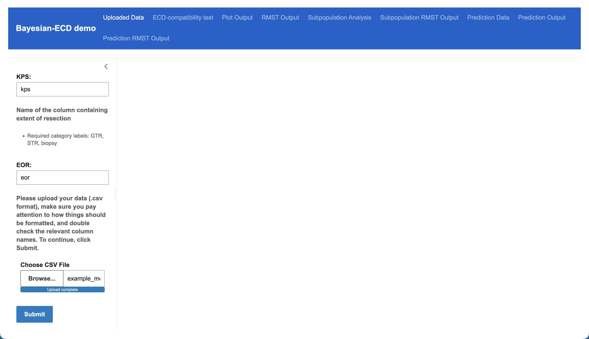
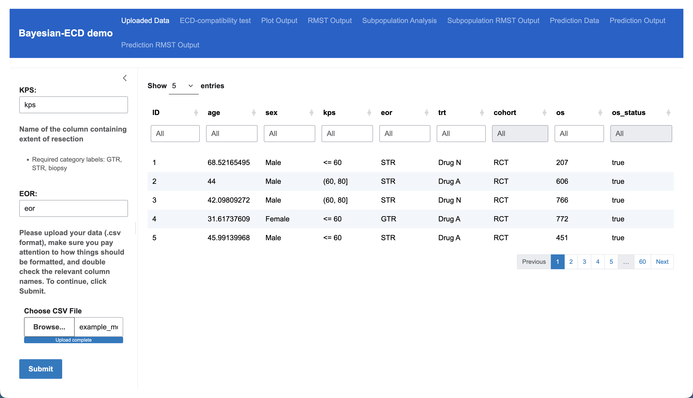
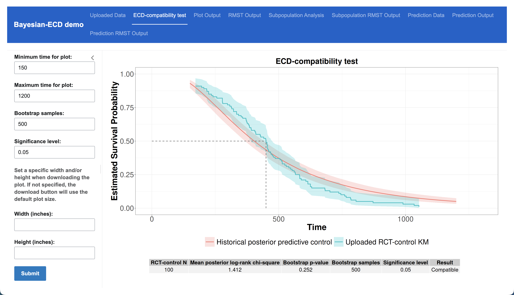
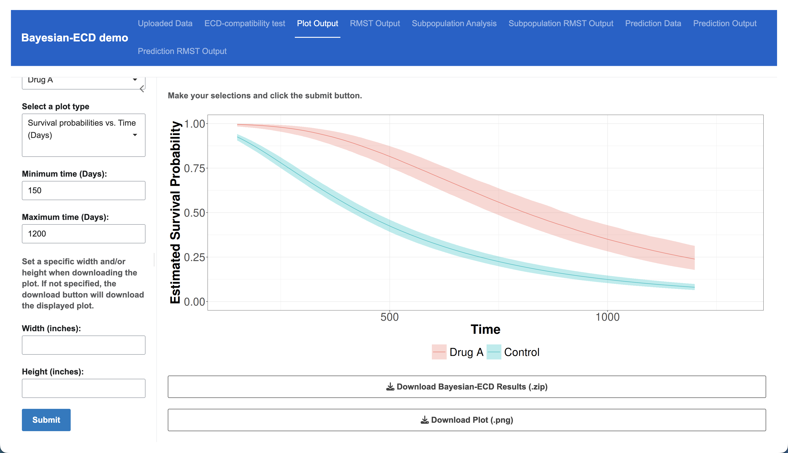
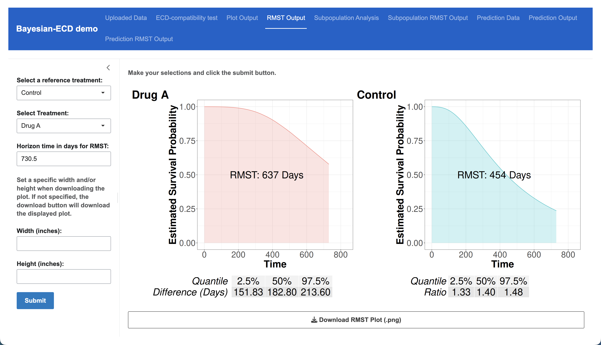
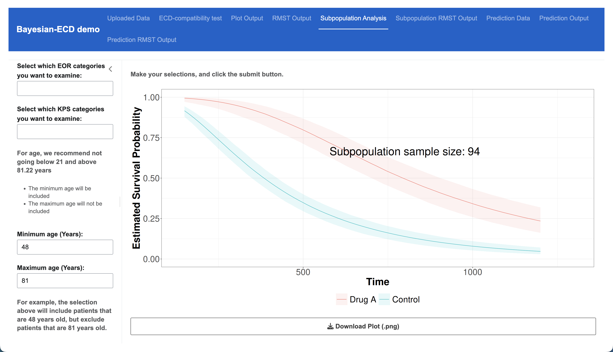
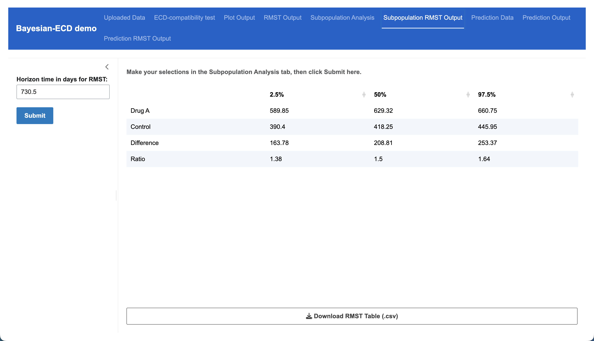
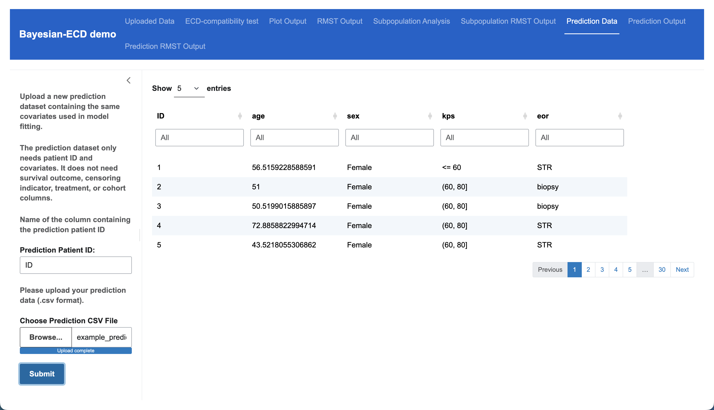
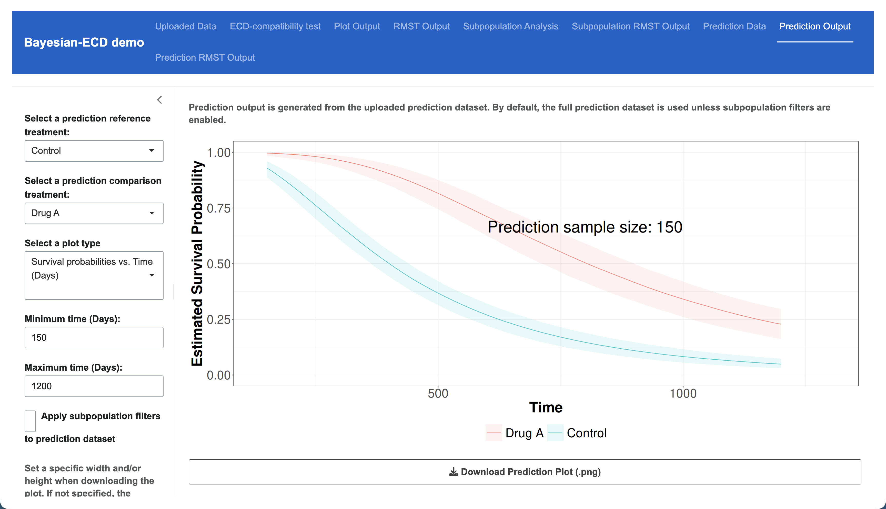
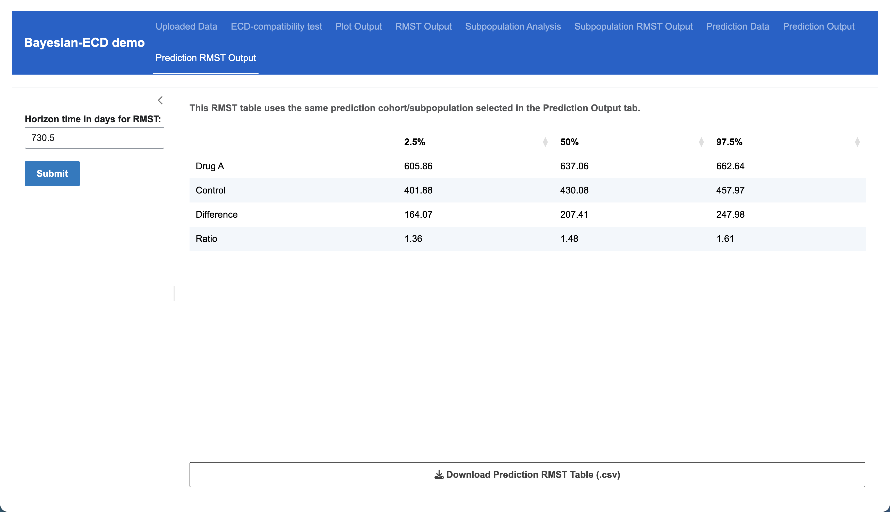

# Bayesian-ECD Shiny App

This repository contains the Bayesian-ECD Shiny application, a local graphical interface for applying the Bayesian-ECD historical-borrowing workflow to a current randomized clinical trial (RCT). The application provides posterior survival and treatment-effect estimation, restricted mean survival time (RMST) summaries, prespecified subpopulation analyses, prediction in new patient populations, and an ECD-compatibility test for trials containing an RCT-control arm.

The application runs locally in R and uses stored posterior information from the historical Bayesian-ECD model. Current RCT data therefore do not need to be uploaded to a separately hosted Bayesian-ECD service.

## User Guide

For complete installation instructions, platform-specific setup, data requirements, analysis workflows, interpretation guidance, output descriptions, reproducibility recommendations, and troubleshooting, see:

- [Bayesian-ECD Shiny User Guide](docs/Bayesian-ECD-Shiny-User-Guide.md)

A rendered PDF version of the user guide is provided separately with the journal supplementary materials.

The user guide is the primary reference for using the application. The example below is intended only as a quick orientation to the workflow.

## Quick Example

The example datasets included with the repository can be used to walk through
the main Bayesian-ECD workflow. The screenshots below illustrate one example
analysis using Control as the reference treatment and Drug A as the comparison
treatment.

### 1. Launch the application

After completing the installation steps in the user guide, open:

```text
app/app.R
```

in RStudio and select:

```text
Run App > Run in Window
```

Alternatively, from the repository root, run:

```r
shiny::runApp("app")
```

For a reproducible example run, a random-number seed can be set immediately
before launching the application:

```r
set.seed(12345)
shiny::runApp("app")
```

The **Uploaded Data** tab is the starting point for the primary Bayesian-ECD
workflow.

### 2. Upload the example current-RCT dataset

Use:

```text
example_data/example_model_data.csv
```

In the **Uploaded Data** tab, enter the column names corresponding to the
patient ID, overall survival, censoring indicator, treatment, cohort, age, sex,
KPS, and extent of resection (EOR), and then select the example CSV file.

For the censoring indicator, `TRUE` denotes an observed event/death and `FALSE`
denotes a censored patient/alive at last follow-up. The application supports
one current trial dataset at a time, so the cohort column should contain a
single cohort value. The categorical variables must use the
labels expected by the stored model: `Female` and `Male` for sex; `> 80`,
`(60, 80]`, and `<= 60` for KPS; and `GTR`, `STR`, and `biopsy` for EOR.



Click **Submit**. The uploaded data are displayed in the application so that
the selected variables and their values can be reviewed before proceeding.



Detailed variable definitions, coding requirements, and input-format guidance
are provided in the user guide.

### 3. Review the ECD-compatibility test

When the uploaded trial contains an RCT-control arm labeled exactly `Control`,
the application evaluates the **ECD-compatibility test** using the current
compatibility settings. With the example dataset, the compatibility analysis
begins automatically after the uploaded data become available.

The test compares the observed RCT-control survival experience with
covariate-standardized Historical-Control predictions from a Stage 2
Bayesian-ECD fit. Historical-Control potential outcomes are generated across
1,000 retained posterior draws, producing a posterior distribution of log-rank
chi-square statistics. The mean posterior log-rank statistic is then calibrated
against a nonparametric bootstrap distribution generated from the observed
RCT-control patients.

The default settings use a plotting range of 150 to 1,200 days, 500 bootstrap
samples, and a significance level of 0.05. These settings can be changed in the
sidebar and the test rerun by clicking **Submit**.



The displayed summary reports the RCT-control sample size, mean posterior
log-rank statistic, bootstrap p-value, number of bootstrap samples, significance
level, and resulting compatibility assessment. The plot can be downloaded as a
PNG, and detailed compatibility results can be downloaded as a ZIP archive.

If the uploaded dataset does not contain an RCT-control arm labeled `Control`,
the compatibility test is unavailable, but the remaining Bayesian-ECD analyses
can still be performed.

### 4. Examine posterior survival or hazard-ratio results

The **Plot Output** tab provides posterior survival-probability and
time-varying hazard-ratio summaries. Select a reference treatment, comparison
treatment, plot type, and time range, and click **Submit**.

For example, the analysis below compares Drug A with Control using posterior
survival probabilities from 150 to 1,200 days.



The displayed plot can be downloaded as a PNG. The underlying Bayesian-ECD
results can also be downloaded as a ZIP archive for additional analysis.

### 5. Examine RMST results

The **RMST Output** tab summarizes restricted mean survival time for a selected
treatment comparison and time horizon. The example below compares Drug A with
Control at a horizon of 730.5 days (2 years).



The output displays treatment-specific RMST curves together with posterior
summaries of the RMST difference and RMST ratio. The combined RMST figure can
be downloaded as a PNG.

### 6. Perform a subpopulation analysis

The **Subpopulation Analysis** tab repeats the survival or hazard-ratio analysis
within a user-defined subset of the uploaded RCT population. Subpopulations can
be defined using sex, EOR, KPS, and age.

For categorical variables, leaving a selection empty leaves that variable
unrestricted. Selecting all available categories likewise does not restrict
that variable. For age, the lower bound is included and the upper bound is
excluded.

The example below compares Drug A with Control among Female patients aged
48 to <81 years, with EOR and KPS unrestricted. In interval notation, the age
selection is `[48, 81)`. The resulting plot also reports the number of patients
meeting the selected criteria.



The **Subpopulation RMST Output** tab uses the treatment comparison and
subpopulation defined in the **Subpopulation Analysis** tab. Specify the RMST
horizon and click **Submit**. The example below uses a 730.5-day horizon.



The resulting RMST table can be downloaded as a CSV file.

### 7. Upload the example prediction dataset

Bayesian-ECD can also generate treatment-specific predictions for a new patient
population with a different covariate distribution. Use:

```text
example_data/example_prediction_data.csv
```

in the **Prediction Data** tab.

Unlike the model-fitting dataset, the prediction dataset requires only a
patient ID and the baseline covariates used by the model. It does not require
observed survival outcomes, censoring indicators, treatment assignments, or
cohort labels.



After entering the prediction patient-ID column and selecting the CSV file,
click **Submit** to make the prediction population available to the prediction
tabs.

### 8. Generate predictions for the new population

The **Prediction Output** tab generates posterior survival-probability or
time-varying hazard-ratio summaries standardized to the covariate distribution
of the uploaded prediction population.

By default, all patients in the prediction dataset are used. Selecting
**Apply subpopulation filters to prediction dataset** exposes optional sex,
EOR, KPS, and age filters. As in the RCT subpopulation analysis, the minimum
age is included and the maximum age is excluded.

The example below compares Drug A with Control for the complete example
prediction dataset over 150 to 1,200 days.



The plot reports the number of prediction patients included in the analysis and
can be downloaded as a PNG.

### 9. Examine prediction-population RMST

The **Prediction RMST Output** tab uses the same treatment comparison and
prediction cohort or subpopulation selected in the **Prediction Output** tab.
Specify an RMST horizon and click **Submit**.

The example below uses the complete example prediction population and a
730.5-day horizon.



The table reports posterior RMST summaries for the two treatments together with
their difference and ratio and can be downloaded as a CSV file.

### 10. Optional posterior-probability analyses

Additional posterior-probability utilities are available outside the Shiny
interface for analyses such as:

- posterior probabilities for prespecified hazard-ratio thresholds;
- posterior probabilities for RMST-difference thresholds; and
- posterior probabilities for RMST-ratio thresholds.

The utility functions are located in:

```text
analysis_utils/posterior-probability-utils.R
```

A worked example is provided in:

```text
examples/run_posterior_probabilities.R
```

From the repository root, the example can be run with:

```r
source("examples/run_posterior_probabilities.R")
```

Generated posterior-probability results are written to the Git-ignored:

```text
outputs/
```

directory.

## Repository Components

The main repository directories are:

- `app/`: Shiny application files.
- `app_core/`: Core modeling, plotting, RMST, subpopulation, and C++ routines used by the application.
- `app/data/storedMCMCiter/`: Stored Stage 1 Bayesian-ECD posterior components used by the application.
- `analysis_utils/`: Optional analysis utilities that are not part of the Shiny interface.
- `examples/`: Worked R examples for optional analyses.
- `example_data/`: Example model-fitting and prediction datasets.
- `docs/`: Bayesian-ECD Shiny User Guide documentation.

## Reproducibility

For reproducible stochastic analyses, set an R random-number seed immediately before launching the application:

```r
set.seed(12345)
shiny::runApp("app")
```

The application uses the RNG state of the R session from which it is launched rather than imposing an independent default analysis seed. If `set.seed()` is not called, the existing R-session RNG state is used and stochastic results are not guaranteed to be reproducible across sessions.

The stored Stage 1 posterior components under:

```text
app/data/storedMCMCiter/
```

are part of the computational specification of the application. Reproducible analyses should identify the repository version used and retain the corresponding input datasets, analysis settings, and outputs.

See the [Bayesian-ECD Shiny User Guide](docs/Bayesian-ECD-Shiny-User-Guide.md) for the complete reproducibility recommendations.
